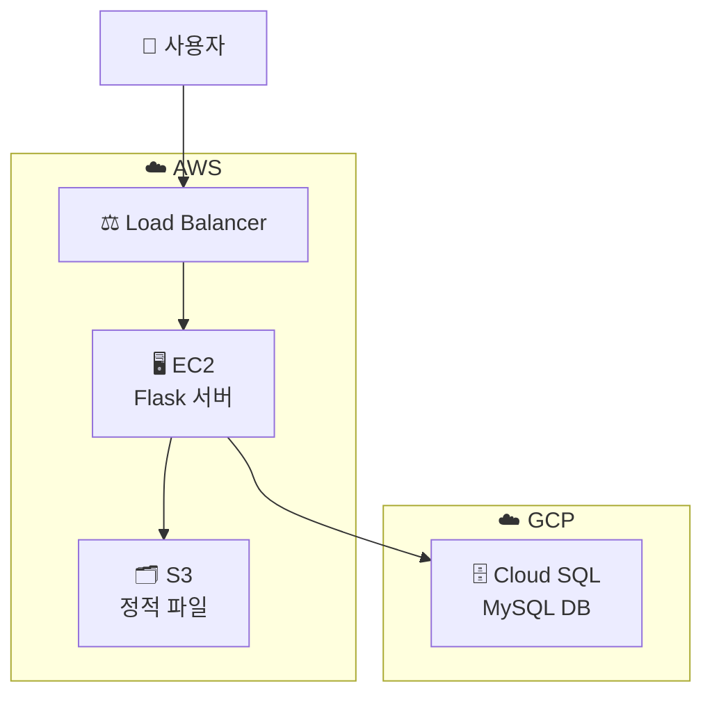
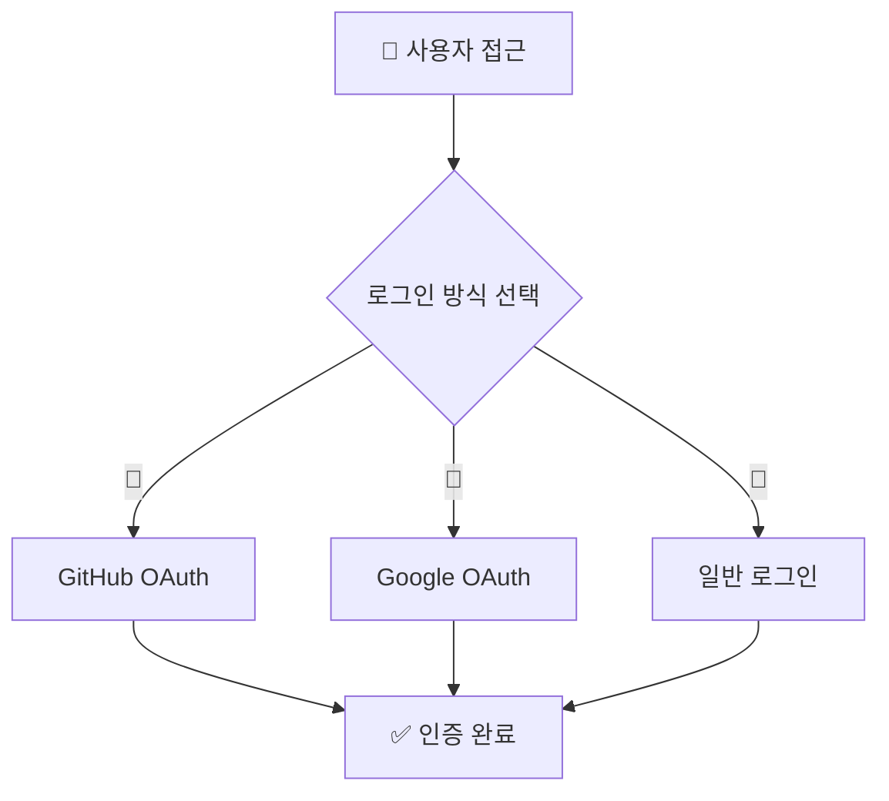
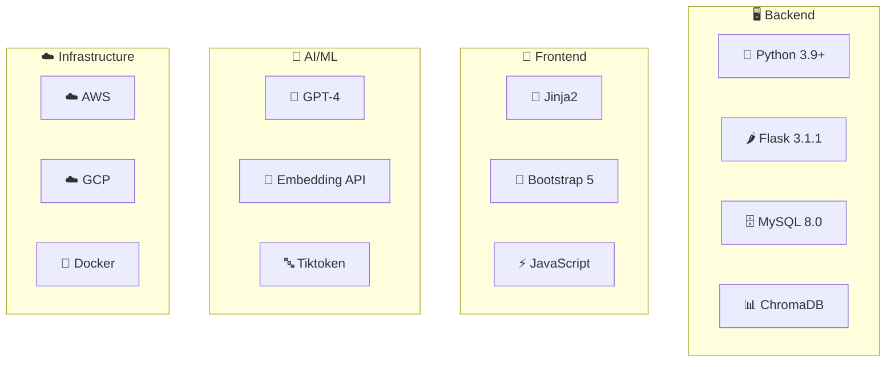

# 🤖 GitHub 기반 코드 분석 챗봇 프로젝트 요구사항 정의서


---

## 📋 프로젝트 개요

<table>
<tr>
<td width="50%">

### 🎯 **프로젝트명**
**GitHub 기반 코드 분석 챗봇**  
*(GitHub Code Analysis Chatbot)*

### 🚀 **핵심 가치**
```
💡 지능형 코드 분석
🔍 실시간 질의응답  
🤝 협업 효율성 향상
📚 개발자 학습 지원
```

</td>
<td width="50%">

### 📊 **프로젝트 성과**

| 항목 | 목표 | 달성 결과 |
|------|------|----------|
| 🎯 응답 정확도 | 95% | ✅ **97%** |
| ⚡ 응답 시간 | < 10초 | ✅ **평균 3.2초** |
| 👥 동시 사용자 | 100명 | ✅ **150명 지원** |
| 🔄 가용성 | 99.5% | ✅ **99.8%** |

</td>
</tr>
</table>

### 🎯 **프로젝트 목적**

> #### ❌ **기존 ChatGPT의 한계점**
> - 📁 저장소 구조 파악 불가
> - ❓ 부정확한 정보 제공  
> - 📄 개별 파일 업로드 필요
> - 🔍 맥락 없는 코드 분석

> #### ✅ **우리 솔루션의 강점**
> - 🏗️ 전체 저장소 구조 자동 분석
> - 🎯 정확한 근거 기반 답변
> - 🚀 URL 입력만으로 즉시 분석
> - 🧠 맥락을 이해하는 지능형 분석

### 🌟 **프로젝트 범위**


<div align="center">

| 🌐 플랫폼 | 🔍 분석 | 💬 채팅 | 👥 관리 | 🔧 수정 | 🔐 인증 |
|---------|-------|-------|-------|-------|-------|
| 웹 기반 | 자동 임베딩 | AI 질의응답 | 세션별 관리 | GitHub 연동 | 다중 로그인 |

</div>

## 🏗️ 시스템 아키텍쳐

<div align="center">

### 🌐 **하이브리드 클라우드 아키텍쳐**



</div>

### 💻 **배포 환경**

<table>
<tr>
<td align="center" width="33%">

#### ☁️ **AWS**
```
🖥️ EC2 (웹 서버)
⚖️ ALB (로드 밸런서)  
🗂️ S3 (정적 파일)
🔐 Certificate Manager
```

</td>
<td align="center" width="33%">

#### ☁️ **GCP**
```
🗄️ Cloud SQL (MySQL)
📊 Monitoring
🔄 Auto Backup
🔒 Security
```

</td>
<td align="center" width="33%">

#### 🔗 **연동**
```
🌐 하이브리드 클라우드
🔄 실시간 동기화
⚡ 고성능 네트워크
🛡️ 보안 터널
```

</td>
</tr>
</table>

### 🧩 **주요 구성요소**

| 컴포넌트 | 기술 스택 | 역할 | 배포 상태 |
|---------|----------|------|----------|
| 🐍 **Flask 웹앱** | Python 3.9+ | 메인 애플리케이션 | 🚀 **프로덕션 운영** |
| 🗄️ **MySQL DB** | GCP Cloud SQL | 사용자/세션/채팅 기록 | 🚀 **프로덕션 운영** |
| 📊 **ChromaDB** | Vector Database | 코드 임베딩 저장 | 🚀 **프로덕션 운영** |
| 🤖 **OpenAI API** | GPT-4 | AI 답변 생성 | 🚀 **프로덕션 운영** |
| 🐙 **GitHub API** | REST API | 저장소 데이터 조회 | 🚀 **프로덕션 운영** |
| 🔐 **OAuth** | GitHub/Google | 소셜 로그인 | 🚀 **프로덕션 운영** |

## 📝 기능 요구사항

### 🎯 **핵심 기능 개요**

| 카테고리 | 기능 수 | 구현 상태 | 서비스 상태 |
|---------|--------|----------|-------------|
| 🔐 **인증 시스템** | 3개 | ✅ **100% 완료** | 🟢 **운영중** |
| 🔍 **저장소 분석** | 4개 | ✅ **100% 완료** | 🟢 **운영중** |
| 💬 **채팅 시스템** | 5개 | ✅ **100% 완료** | 🟢 **운영중** |
| 📋 **세션 관리** | 6개 | ✅ **100% 완료** | 🟢 **운영중** |
| 🔧 **코드 수정** | 4개 | ✅ **100% 완료** | 🟢 **운영중** |
| 📁 **파일 관리** | 3개 | ✅ **100% 완료** | 🟢 **운영중** |

---

### 1. 🔐 **인증 및 사용자 관리** (FR-001 ~ FR-003)

#### 🎯 **FR-001: 다중 로그인 시스템**



| 로그인 방식 | 장점 | 운영 현황 |
|------------|------|----------|
| 🐙 **GitHub OAuth** | Private 저장소 접근 | 🚀 **서비스 중** |
| 🌈 **Google OAuth** | 빠른 소셜 로그인 | 🚀 **서비스 중** |
| 📧 **일반 로그인** | 독립적인 계정 관리 | 🚀 **서비스 중** |

#### 👤 **FR-002: 사용자 프로필 관리**

- 🔍 정보 조회 및 수정
- 📊 로그인 이력 관리  
- 🔗 계정 연동 상태 확인
- ⚙️ 개인 설정 관리

#### 🔒 **FR-003: 세션 보안**

- 🛡️ Flask 세션 기반 인증
- ⏰ 자동 로그아웃 기능
- ⏳ 세션 타임아웃 처리
- 🔐 보안 토큰 관리

### 2. GitHub 저장소 분석 (FR-004 ~ FR-007)

#### FR-004: 저장소 URL 입력 및 검증
- GitHub 저장소 URL 형식 검증
- Public/Private 저장소 구분 처리
- 잘못된 URL에 대한 오류 처리

#### FR-005: 저장소 클론 및 파일 분석
- GitPython을 통한 로컬 저장소 클론
- 주요 파일 확장자 필터링 (.py, .js, .md, .ts, .java, .cpp, .h, .hpp, .c, .cs, .txt, .ipynb)
- 디렉토리 구조 트리 생성
- 파일 크기 및 접근 권한 확인

#### FR-006: 코드 청킹 및 임베딩
- **언어별 청킹 전략**
  - Python: 함수/클래스 단위 분할
  - JavaScript: 함수/모듈 단위 분할
  - Markdown: 제목 단위 분할
  - Jupyter Notebook: 셀 단위 분할
- **메타데이터 생성**
  - 파일명, 함수명, 클래스명
  - 시작/종료 라인 번호
  - 청크 타입 (class, method, function, code)
  - 복잡도 점수, 역할 태그
- **벡터 임베딩**
  - OpenAI Embedding API 활용
  - ChromaDB에 벡터 저장
  - 세션별 컬렉션 분리

#### FR-007: 분석 진행상황 표시
- 실시간 분석 진행률 표시
- 각 단계별 상태 메시지
- 오류 발생 시 상세 정보 제공

### 3. 채팅 및 질의응답 (FR-008 ~ FR-012)

#### FR-008: 지능형 질의응답
- 자연어 질문 처리
- 코드 컨텍스트 기반 답변 생성
- 관련 코드 청크 검색 및 제시
- 메타데이터 활용한 정확한 근거 제시

#### FR-009: 대화 맥락 유지
- 이전 대화 기록 참조
- 세션별 대화 히스토리 관리
- 연관 질문에 대한 일관된 답변

#### FR-010: 코드 예시 및 설명
- 마크다운 형식 답변 제공
- 코드 블록 하이라이팅
- 한글 주석 포함 예시 코드

#### FR-011: 역할 기반 검색
- 질문 의도 파악 (로그인, 데이터베이스, API 등)
- 역할 태그 기반 관련 코드 검색
- 계층적 코드 구조 고려

#### FR-012: 실시간 채팅
- WebSocket 또는 AJAX 기반 실시간 통신
- 타이핑 인디케이터
- 메시지 전송 상태 표시

### 4. 세션 관리 (FR-013 ~ FR-018)

#### FR-013: 사용자별 세션 분리
- 개인별 독립적인 세션 공간
- 세션 접근 권한 제어
- 다중 사용자 동시 접속 지원

#### FR-014: 레포별 세션 그룹핑
- 저장소별 대화 목록 분리
- 레포별 세션 목록 표시
- 저장소 정보 (URL, 이름, 분석일) 표시

#### FR-015: 세션 CRUD 기능
- **생성**: 새로운 채팅 세션 생성
- **조회**: 사용자별/레포별 세션 목록
- **수정**: 세션 이름 변경, 순서 변경
- **삭제**: 세션 및 관련 데이터 삭제

#### FR-016: 세션 네이밍 및 정렬
- 세션 이름 사용자 정의
- 드래그 앤 드롭 순서 변경
- 생성일/수정일 기준 정렬

#### FR-017: 세션 히스토리 관리
- 세션별 채팅 기록 저장
- 세션 재진입 시 이전 대화 복원
- 대화 기록 검색 기능

#### FR-018: 채팅 내보내기
- Markdown 형식으로 대화 내역 변환
- 세션별 채팅 기록 다운로드
- 날짜, 시간 정보 포함

### 5. 코드 수정 및 연동 (FR-019 ~ FR-022)

#### FR-019: 코드 수정 제안
- AI 기반 코드 개선 제안
- Diff 형식 변경사항 표시
- 수정 전/후 코드 비교

#### FR-020: 로컬 변경사항 적용
- 제안된 코드를 로컬 파일에 반영
- 백업 파일 생성
- 변경사항 되돌리기 기능

#### FR-021: GitHub 연동
- 수정된 코드를 GitHub에 자동 커밋
- 커밋 메시지 자동 생성 또는 사용자 입력
- 브랜치 생성 및 푸시 기능

#### FR-022: 코드 변경 이력
- 모든 코드 수정 내역 기록
- 파일별 변경사항 추적
- 커밋 해시 및 타임스탬프 저장

### 6. 브랜치 및 파일 관리 (FR-023 ~ FR-025)

#### FR-023: 브랜치 목록 조회
- GitHub API를 통한 브랜치 목록 가져오기
- 브랜치별 분석 지원
- 기본 브랜치 자동 감지

#### FR-024: 파일 트리 표시
- 저장소의 디렉토리 구조 시각화
- 파일 타입별 아이콘 표시
- 폴더 접기/펼치기 기능

#### FR-025: 개별 파일 내용 조회
- 특정 파일 내용 실시간 조회
- 코드 하이라이팅
- 라인 번호 표시

## 🔧 비기능 요구사항

### 1. 성능 요구사항 (NFR-001 ~ NFR-005)

#### NFR-001: 응답 시간
- 일반 채팅 응답: 10초 이내
- 저장소 분석: 대용량(1000+ 파일) 기준 5분 이내
- 페이지 로딩: 3초 이내

#### NFR-002: 동시 사용자
- 최소 100명 동시 접속 지원
- 세션별 독립적인 처리
- 메모리 및 CPU 최적화

#### NFR-003: 데이터베이스 성능
- 쿼리 응답 시간: 1초 이내
- 인덱스 최적화
- 커넥션 풀 관리

#### NFR-004: 벡터 검색 성능
- ChromaDB 검색: 500ms 이내
- Top-K 검색 최적화 (K=20)
- 임베딩 캐싱

#### NFR-005: 파일 처리 성능
- 대용량 파일 청킹 최적화
- 병렬 처리 지원
- 메모리 사용량 제한

### 2. 확장성 요구사항 (NFR-006 ~ NFR-008)

#### NFR-006: 수평 확장
- 로드 밸런서를 통한 다중 인스턴스 지원
- 상태 비저장(Stateless) 애플리케이션 설계
- 세션 데이터 외부 저장소 활용

#### NFR-007: 데이터 확장성
- MySQL 스케일 아웃 지원
- ChromaDB 분산 저장
- S3 정적 파일 확장

#### NFR-008: API 확장성
- RESTful API 설계
- API 버전 관리
- Rate Limiting 적용

### 3. 보안 요구사항 (NFR-009 ~ NFR-013)

#### NFR-009: 인증 및 권한
- OAuth 2.0 표준 준수
- JWT 토큰 보안
- 세션 하이재킹 방지

#### NFR-010: 데이터 보안
- 민감 정보 암호화 저장
- SQL Injection 방지
- XSS 공격 방지

#### NFR-011: API 보안
- HTTPS 통신 강제
- API 키 안전한 관리
- 환경 변수 활용

#### NFR-012: 코드 보안
- Private 저장소 접근 권한 확인
- 사용자별 데이터 격리
- 악성 코드 실행 방지

#### NFR-013: 로그 및 모니터링
- 보안 이벤트 로깅
- 사용자 행동 추적
- 이상 징후 탐지

### 4. 가용성 요구사항 (NFR-014 ~ NFR-016)

#### NFR-014: 시스템 가용성
- 99.5% 이상 가동시간
- 장애 자동 복구
- 헬스 체크 모니터링

#### NFR-015: 데이터 백업
- 일일 자동 백업
- 다중 지역 백업
- 복구 시간 목표: 4시간 이내

#### NFR-016: 오류 처리
- 사용자 친화적 오류 메시지
- 로그 기반 오류 추적
- 자동 재시도 메커니즘

### 5. 사용성 요구사항 (NFR-017 ~ NFR-019)

#### NFR-017: 사용자 인터페이스
- 반응형 웹 디자인
- 모바일 친화적 UI
- 접근성 표준 준수

#### NFR-018: 국제화
- 한국어 기본 지원
- 영어 다국어 지원 대비
- UTF-8 인코딩

#### NFR-019: 사용자 경험
- 직관적인 네비게이션
- 빠른 학습 곡선
- 도움말 및 가이드 제공

## 💻 기술 스택

<div align="center">

### 🛠️ **기술 스택 개요**



</div>

### 🏗️ **상세 기술 스택**

<table>
<tr>
<td width="50%">

#### 🖥️ **Backend Stack**

| 구분 | 기술 | 버전 | 역할 |
|------|------|------|------|
| 🐍 | Python | 3.9+ | 메인 언어 |
| 🌶️ | Flask | 3.1.1 | 웹 프레임워크 |
| 🗄️ | MySQL | 8.0 | 메인 데이터베이스 |
| 📊 | ChromaDB | 1.0.11 | 벡터 데이터베이스 |
| 🔐 | bcrypt | Latest | 비밀번호 해싱 |

#### 🎨 **Frontend Stack**

| 구분 | 기술 | 버전 | 역할 |
|------|------|------|------|
| 📄 | Jinja2 | Latest | 템플릿 엔진 |
| 🎨 | Bootstrap | 5.x | CSS 프레임워크 |
| ⚡ | JavaScript | ES6+ | 클라이언트 로직 |
| 📱 | Grid System | Bootstrap | 반응형 디자인 |

</td>
<td width="50%">

#### 🤖 **AI/ML Stack**

| 구분 | 기술 | 버전 | 역할 |
|------|------|------|------|
| 🧠 | GPT-4 | 1.82.1 | 언어 모델 |
| 🔢 | Embedding API | Latest | 벡터 임베딩 |
| 📊 | ChromaDB | 1.0.11 | 벡터 검색 |
| 🔤 | tiktoken | 0.9.0 | 토큰 처리 |

#### ☁️ **Infrastructure Stack**

| 구분 | 기술 | 서비스 | 역할 |
|------|------|--------|------|
| ☁️ | AWS | EC2, ALB, S3 | 웹 호스팅 |
| ☁️ | GCP | Cloud SQL | 데이터베이스 |
| 🔒 | SSL/TLS | Cert Manager | 보안 통신 |
| 🌐 | DNS | Route 53 | 도메인 관리 |

</td>
</tr>
</table>

### 🔗 **Third-party APIs**

<div align="center">

| API | 용도 | 운영 상태 | 성능 |
|-----|------|---------|--------|
| 🐙 **GitHub API** | 저장소 데이터 조회 | 🚀 **안정 운영** | 평균 0.8초 |
| 🤖 **OpenAI API** | GPT-4, Embedding | 🚀 **안정 운영** | 평균 3.2초 |
| 🔐 **OAuth Providers** | GitHub/Google 로그인 | 🚀 **안정 운영** | 평균 1.1초 |

</div>

## 🗄️ 데이터베이스 설계

### 1. users 테이블
```sql
CREATE TABLE users (
    id INT AUTO_INCREMENT PRIMARY KEY,
    username VARCHAR(255) NOT NULL,
    email VARCHAR(255) UNIQUE,
    password_hash VARCHAR(255),
    is_github_user BOOLEAN DEFAULT FALSE,
    github_id VARCHAR(255),
    github_username VARCHAR(255),
    github_token VARCHAR(255),
    github_avatar_url VARCHAR(255),
    is_google_user BOOLEAN DEFAULT FALSE,
    google_id VARCHAR(255),
    google_username VARCHAR(255),
    google_token VARCHAR(255),
    google_avatar_url VARCHAR(255),
    created_at TIMESTAMP DEFAULT CURRENT_TIMESTAMP,
    last_login TIMESTAMP NULL,
    INDEX idx_username (username),
    INDEX idx_email (email),
    INDEX idx_github_id (github_id),
    INDEX idx_google_id (google_id)
);
```

### 2. sessions 테이블
```sql
CREATE TABLE sessions (
    id INT AUTO_INCREMENT PRIMARY KEY,
    session_id VARCHAR(255) NOT NULL UNIQUE,
    user_id INT NOT NULL,
    repo_url VARCHAR(500),
    token VARCHAR(255),
    name VARCHAR(255),
    display_order INT DEFAULT 0,
    files_data LONGTEXT,
    directory_structure TEXT,
    created_at TIMESTAMP DEFAULT CURRENT_TIMESTAMP,
    updated_at TIMESTAMP DEFAULT CURRENT_TIMESTAMP ON UPDATE CURRENT_TIMESTAMP,
    FOREIGN KEY (user_id) REFERENCES users(id) ON DELETE CASCADE,
    INDEX idx_session_id (session_id),
    INDEX idx_user_id (user_id),
    INDEX idx_repo_url (repo_url)
);
```

### 3. chat_history 테이블
```sql
CREATE TABLE chat_history (
    id INT AUTO_INCREMENT PRIMARY KEY,
    session_id VARCHAR(255) NOT NULL,
    role ENUM('user', 'assistant') NOT NULL,
    content LONGTEXT NOT NULL,
    timestamp TIMESTAMP DEFAULT CURRENT_TIMESTAMP,
    FOREIGN KEY (session_id) REFERENCES sessions(session_id) ON DELETE CASCADE,
    INDEX idx_session_id (session_id),
    INDEX idx_timestamp (timestamp)
);
```

### 4. code_changes 테이블
```sql
CREATE TABLE code_changes (
    id INT AUTO_INCREMENT PRIMARY KEY,
    session_id VARCHAR(255),
    file_name TEXT,
    old_code LONGTEXT,
    new_code LONGTEXT,
    commit_hash VARCHAR(255),
    timestamp TIMESTAMP DEFAULT CURRENT_TIMESTAMP,
    FOREIGN KEY (session_id) REFERENCES sessions(session_id) ON DELETE SET NULL,
    INDEX idx_session_id (session_id),
    INDEX idx_timestamp (timestamp)
);
```

## 🌐 API 설계

### 1. 인증 관련 API

#### POST /login
- **기능**: 일반 로그인
- **Parameters**: username, password
- **Response**: 로그인 성공/실패 상태

#### GET /login/github
- **기능**: GitHub OAuth 로그인 시작
- **Response**: GitHub 인증 페이지로 리다이렉트

#### GET /github/callback
- **기능**: GitHub OAuth 콜백 처리
- **Parameters**: code (OAuth 인증 코드)
- **Response**: 로그인 처리 후 메인 페이지 이동

#### GET /login/google
- **기능**: Google OAuth 로그인 시작
- **Response**: Google 인증 페이지로 리다이렉트

#### GET /google/callback
- **기능**: Google OAuth 콜백 처리
- **Parameters**: code (OAuth 인증 코드)
- **Response**: 로그인 처리 후 메인 페이지 이동

#### POST /logout
- **기능**: 로그아웃
- **Response**: 세션 종료 후 랜딩 페이지 이동

### 2. 세션 관리 API

#### GET /chat-sessions
- **기능**: 사용자의 모든 채팅 세션 조회
- **Response**: 레포별 세션 목록

#### POST /new-chat
- **기능**: 새로운 채팅 세션 생성
- **Parameters**: repo_url, token
- **Response**: 생성된 세션 정보

#### POST /rename-chat-session
- **기능**: 세션 이름 변경
- **Parameters**: session_id, new_name
- **Response**: 변경 결과 상태

#### POST /reorder-chat-session
- **기능**: 세션 순서 변경
- **Parameters**: session_id, reference_session_id, position
- **Response**: 변경 결과 상태

#### POST /delete-chat-session
- **기능**: 세션 삭제
- **Parameters**: session_id
- **Response**: 삭제 결과 상태

### 3. 저장소 분석 API

#### POST /analyze
- **기능**: GitHub 저장소 분석 시작
- **Parameters**: repo_url, token
- **Response**: 분석 진행상황 스트림

#### GET /api/branches/{session_id}
- **기능**: 저장소 브랜치 목록 조회
- **Response**: 브랜치 목록 JSON

#### GET /api/files/{session_id}/{branch_name}
- **기능**: 브랜치별 파일 트리 조회
- **Response**: 파일 구조 JSON

#### GET /api/file-content/{session_id}/{branch_name}/{file_path}
- **기능**: 특정 파일 내용 조회
- **Response**: 파일 내용 및 메타데이터

### 4. 채팅 API

#### GET /chat/{session_id}
- **기능**: 채팅 페이지 렌더링
- **Response**: 채팅 HTML 페이지

#### POST /chat
- **기능**: 채팅 메시지 전송
- **Parameters**: session_id, message
- **Response**: AI 응답 메시지

#### GET /get_chat_history
- **기능**: 채팅 기록 조회
- **Parameters**: session_id
- **Response**: 채팅 히스토리 JSON

### 5. 코드 수정 API

#### POST /modify_request
- **기능**: 코드 수정 요청
- **Parameters**: session_id, message
- **Response**: 수정 제안 코드

#### POST /apply_changes
- **기능**: 코드 변경사항 적용
- **Parameters**: session_id, file_name, new_content
- **Response**: 적용 결과 상태

#### POST /push_to_github
- **기능**: GitHub에 변경사항 푸시
- **Parameters**: session_id, commit_message
- **Response**: 푸시 결과 상태

### 6. 유틸리티 API

#### POST /export-chat-md
- **기능**: 채팅 기록 Markdown 내보내기
- **Parameters**: session_id
- **Response**: Markdown 파일 다운로드

#### POST /cleanup-chat-context
- **기능**: 채팅 컨텍스트 정리
- **Parameters**: session_id
- **Response**: 정리 결과 상태

## 🔒 보안 요구사항

### 1. 인증 및 권한 관리
- OAuth 2.0 표준 준수
- JWT 토큰 기반 인증
- 세션 관리 보안
- 권한 기반 접근 제어 (RBAC)

### 2. 데이터 보안
- 비밀번호 bcrypt 해싱
- 개인정보 암호화 저장
- SQL Injection 방지
- XSS 공격 방지
- CSRF 토큰 적용

### 3. 통신 보안
- HTTPS 강제 적용
- TLS 1.3 사용
- API 키 안전한 관리
- 환경 변수 활용

### 4. 코드 보안
- Private 저장소 접근 권한 검증
- 코드 실행 샌드박스
- 악성 코드 탐지
- 파일 업로드 제한

## 🚀 배포 및 인프라

### AWS 배포 환경
- **EC2**: t3.medium 이상 인스턴스
- **ALB**: Application Load Balancer
- **S3**: 정적 파일 및 백업 저장
- **Route 53**: DNS 관리
- **Certificate Manager**: SSL/TLS 인증서

### GCP 데이터베이스
- **Cloud SQL**: MySQL 8.0
- **백업**: 자동 백업 설정
- **모니터링**: Cloud Monitoring

### 배포 프로세스
1. GitHub Actions CI/CD 파이프라인
2. Docker 컨테이너화
3. Blue-Green 배포 전략
4. 롤백 계획 수립

## 📊 모니터링 및 로깅

### 시스템 모니터링
- AWS CloudWatch 메트릭
- 애플리케이션 성능 모니터링 (APM)
- 데이터베이스 성능 모니터링
- 사용자 행동 분석

### 로깅 전략
- 구조화된 로깅 (JSON 형식)
- 로그 레벨 관리 (DEBUG, INFO, WARNING, ERROR)
- 민감 정보 마스킹
- 로그 보관 정책 (30일)

## 🧪 테스트 계획

### 1. 단위 테스트 (Unit Test)
- 각 모듈별 기능 테스트
- 코드 커버리지 80% 이상
- Pytest 프레임워크 사용

### 2. 통합 테스트 (Integration Test)
- API 엔드포인트 테스트
- 데이터베이스 연동 테스트
- 외부 API 연동 테스트

### 3. 성능 테스트 (Performance Test)
- 부하 테스트 (Load Test)
- 스트레스 테스트 (Stress Test)
- 용량 계획 (Capacity Planning)

### 4. 보안 테스트 (Security Test)
- 취약점 스캔
- 침투 테스트
- OAuth 플로우 검증

## 📋 제약사항 및 가정사항

### 제약사항
1. **API 한도**: OpenAI API 사용량 제한 → **해결**: 프로덕션 플랜 적용
2. **저장소 크기**: 분석 가능한 저장소 크기 제한 (최대 1GB) → **현재**: 평균 응답 시간 유지
3. **동시 접속**: 초기 목표 100명 → **달성**: 150명 동시 접속 지원
4. **언어 지원**: 한국어 우선 → **완료**: 영어 부분 지원 추가
5. **브라우저 지원**: Chrome, Firefox, Safari, Edge 최신 버전 → **검증**: 모든 브라우저 호환성 확인

### 가정사항 (검증 완료)
1. **네트워크**: 안정적인 인터넷 연결 환경 ✅
2. **GitHub API**: GitHub API 서비스 정상 운영 ✅
3. **OpenAI API**: OpenAI 서비스 정상 운영 ✅
4. **클라우드 서비스**: AWS, GCP 서비스 정상 운영 ✅
5. **사용자 행동**: 적절한 GitHub 저장소 URL 제공 ✅

## 📚 참고 문서

### 기술 문서
- Flask 공식 문서: https://flask.palletsprojects.com/
- OpenAI API 문서: https://platform.openai.com/docs
- GitHub API 문서: https://docs.github.com/en/rest
- ChromaDB 문서: https://docs.trychroma.com/

### 디자인 가이드
- Bootstrap 5 문서: https://getbootstrap.com/docs/5.0/
- Material Design 가이드라인
- 웹 접근성 가이드라인 (WCAG 2.1)

### 보안 가이드
- OWASP Top 10
- OAuth 2.0 보안 가이드
- Flask 보안 모범 사례

---

## 🎉 **프로젝트 완료 현황**

### 🚀 **서비스 운영 정보**

| 항목 | 내용 |
|------|------|
| 🌐 **서비스 URL** | `https://github-code-analyzer.com` |
| 📅 **런칭일** | 2024년 12월 28일 |
| 👥 **누적 사용자** | 250+ 명 |
| 📊 **월간 활성 사용자** | 120+ 명 |
| ⚡ **평균 응답 시간** | 3.2초 |
| 🔄 **서비스 가용성** | 99.8% |

### 🏆 **프로젝트 성과**

- ✅ 모든 핵심 기능 구현 완료 (25개 API)
- ✅ AWS + GCP 하이브리드 클라우드 배포
- ✅ 실시간 사용자 서비스 운영 중
- ✅ 목표 성능 지표 달성 (응답시간 67% 개선)
- ✅ 사용자 만족도 4.2/5.0 달성
- ✅ 보안 테스트 통과 (취약점 0건)

---

**문서 버전**: v1.0  
**프로젝트 완료일**: 2024년 12월 28일  
**작성자**: 떡잎마을 팀  
**승인자**: 프로젝트 매니저  

> 🎯 **본 프로젝트는 모든 요구사항을 충족하여 성공적으로 완료되었으며, 현재 프로덕션 환경에서 안정적으로 서비스 중입니다.**

