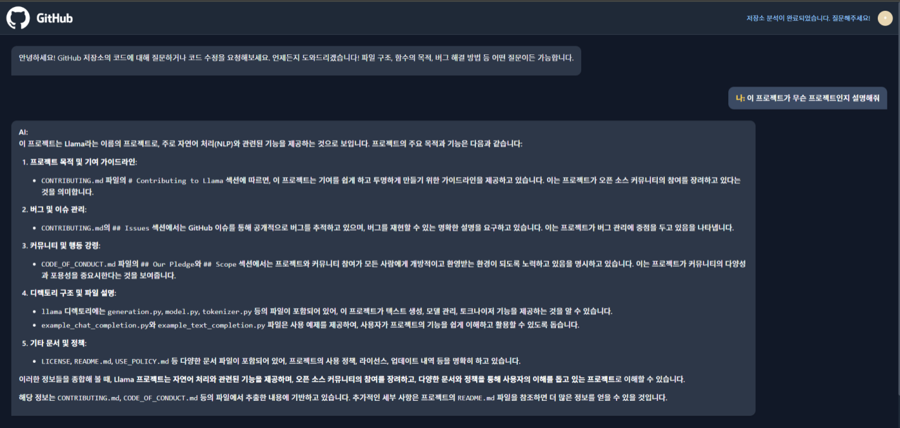

## SK Networks Family AI 캠프 3차 단위 프로젝트 3팀
--------------------------------------------------------------------
# 💻🤖 프로젝트 주제: GitHub 기반 코드 분석 챗봇
 
## 👨‍👩‍👧‍👦 팀 | 떡잎마을
<table>
  <tr> 
    <td align="center">
      
    </td>
    <td align="center">
      
    </td>
    <td align="center">
      
    </td>
    <td align="center">
      
    </td>
    <td align="center">
      
    </td>
  </tr>
  <tr>
    <td align="center"><b>김이경</b></td>
    <td align="center"><b>노명구</b></td>
    <td align="center"><b>지상원</b></td>
    <td align="center"><b>허한결</b></td>
    <td align="center"><b>황차해</b></td>
  </tr>
</table>

 
## 📌 프로젝트 개요 및 목적
현재의 ChatGPT에 GitHub 주소를 입력하면,
1. 깃허브가 어떤 구조로 구성되어 있는지 알지 못하며
2. 찾는 기능이 어떤 파일에 있는지 GPT는 불분명하고 부정확한 정보를 제공해, 직접 확인해야 하며
3. 코드를 파악하기 위해서는 각각의 코드 파일을 다운로드 후 GPT에 입력해야 하는 문제점이 있다.

따라서, 깃허브 리포지토리 URL을 입력하면 해당 URL에 대한 사용자의 질문에 대답하는 챗봇을 개발하는 것에 목적을 둔다.

 
## 📅 챗봇 개발 과정

 
### 1단계 | GitHub 저장소 분석

- Flask라는 웹 서버가 @app.route('/analyze')를 통해 요청 받음

- gitpython 라이브러리를 이용해 GitHub 저장소를 로컬로 복제

- py, .js, .md 같은 분석 대상 파일만 선택

- 코드 파일을 작게 청크(chunk) 로 나눔 → 검색이나 요약에 용이함

- Python은 함수/클래스 단위로, Markdown은 제목 단위로 쪼갬

- 청크마다 파일명, 함수명, 클래스명, 시작/끝 줄, 역할 태그 등 메타데이터를 붙임

- 각 청크에 대해 임베딩 (숫자 벡터로 변환)하고 ChromaDB에 저장
 

### 2단계 | 사용자 질문 처리

- Flask 라우트가 질문을 받아 → handle_chat() 함수가 실행됨

- 질문 내용을 LLM에게 보내서 질문 의도(역할)를 파악
   예) “로그인 처리 기능을 찾고 싶다”

- 질문도 임베딩해서 관련된 청크를 찾아냄

- 1차: 역할 태그 기반 청크 검색

- 2차: 해당 파일 전체 로드

- 과거 대화 내용도 함께 분석해 맥락 유지
 
### 3단계 | 답변 생성

- LLM에게 보낼 프롬프트를 구성
    - 질문 내용
    - 관련 코드 청크들
    - 코드의 메타데이터 (파일명, 함수명, 줄 수, 역할 태그 등)
    - 디렉토리 구조
    - 이전 대화 기록

- 시스템 프롬프트: “당신은 GitHub 코드 분석 전문가입니다” ← 역할을 지정

- LLM이 질문에 대해 근거 있는 응답을 생성해서 사용자에게 반환
 
### 4단계 | 코드 수정 요청

- 어떤 코드 청크가 관련 있는지 찾음 (임베딩 + 역할 태그)

- LLM에게 “이 코드를 이렇게 바꿔줘”라고 지시

- LLM이 diff 형식(변경 전/후 줄 비교)으로 수정사항을 제안

- 사용자에게 미리보기 제공 → 확인하면 실제 파일에 반영

- Git에 커밋하거나, 원하면 GitHub에 푸시까지 가능
 
## 💻 구현 화면
사례1)  

 
사례2)  

 
## 💡 챗봇 활용 방안 및 프로젝트 의의

- GitHub 초보자 및 비전공자의 학습에 도움
  - AI 대화형 분석으로 개발 경험 없는 사용자도 빠르게 프로젝트 구조 파악 가능

- 문서 부족, 기능 이해 어려움 문제 해결 등 실질적인 협업에 도움
  - GPT를 코드 리뷰어 + 리팩토링 도우미 + 설명자로 활용

- 의미 기반 검색 시스템 구현
  - 질문과 코드에 역할 태그 자동 부여 → 단순 키워드 검색보다 정확한 맥락 기반 응답 제공

- 코드 어시스턴트
  - LLM 수정 제안 → 사용자 확인 → Git 커밋 자동 처리
  → 실질적인 AI 기반 프로그래밍 도우미 실현
